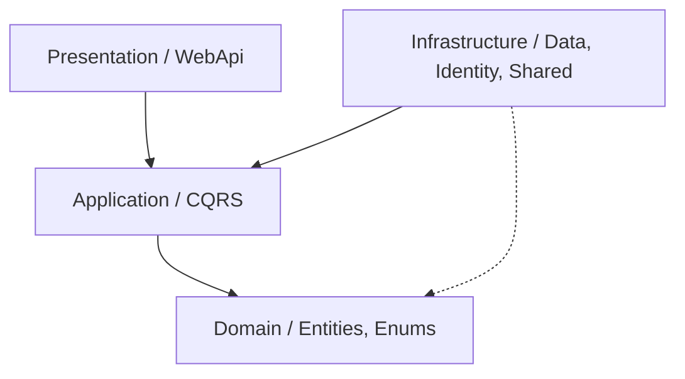

# SkyLabIdP

高效能的 .NET 10 身份識別提供者（Identity Provider, IdP），基於 **Clean Architecture** 與 **Dapper Hybrid** 架構設計。作為 SkyLab 生態系的認證與授權核心，支援多租戶架構、RSA-256 JWT 簽署及 Google OAuth 2.0 整合。

---

## 🚀 核心特性

- **.NET 10 頂尖效能**：全面採用 .NET 10 新特性與效能優化。
- **Hybrid 資料存取模式**：
  - **EF Core**：專注於 ASP.NET Core Identity 橋接與資料庫遷移（Migrations）。
  - **Dapper + Unit of Work**：接管所有業務邏輯查詢與寫入，確保 SQL 完全透明且具備極致效能。
- **多租戶支援 (Multi-Tenancy)**：透過 `X-Tenant-Id` 標頭實現邏輯隔離，支援多套獨立的權限與登入邏輯。
- **現代化安全性**：
  - **RSA-256 JWT**：支援自動金鑰輪換（Key Rotation）與標準 JWKS 端點。
  - **Hybrid MultiAuth**：智能切換 JWT Bearer（API）與 Cookie（OAuth 流程）驗證模式。
- **CQRS 模式**：利用 MediatR 實作 Command 與 Query 分離，內建完整的 Pipeline Behaviors（驗證、性能監控、異常處理）。

---

## 🏗️ 系統架構

專案嚴格遵循 **Clean Architecture** 原則，確保高可測試性與低耦合度：



### 目錄結構

- **`src/core/SkyLabIdP.Domain`**：核心實體、列舉與設定，無任何外部相依。
- **`src/core/SkyLabIdP.Application`**：業務邏輯核心，包含 MediatR Handlers (CQRS)、DTOs、Validators (FluentValidation) 及 Mapperly 轉換。
- **`src/infrastructure/SkyLabIdP.Data`**：資料持久層。包含 Dapper Repositories、Unit of Work 實作及 EF Core DbContext。
- **`src/infrastructure/SkyLabIdP.Identity`**：身份認證層。處理 JWT 發行、Google OAuth 整合及令牌生命週期管理。
- **`src/infrastructure/SkyLabIdP.Shared`**：通用基礎設施。包含 Redis 快取、Email (MailKit)、檔案處理等。
- **`src/presentation/SkyLabIdP.WebApi`**：API 進入點。負責 DI 組裝、中介軟體配置與控制器路由。

---

## 🛠️ 技術棧

- **Runtime**: .NET 10 (LTS)
- **Database**: SQL Server + EF Core (Identity) + Dapper (Business)
- **Caching**: Redis
- **Messaging**: MediatR (CQRS)
- **Validation**: FluentValidation
- **Authentication**: JWT (RSA-256), Google OAuth 2.0
- **Logging**: Serilog
- **Testing**: xUnit, Moq, FluentAssertions, Playwright (E2E)

---

## 🏁 快速開始

### 環境需求
- [.NET 10 SDK](https://dotnet.microsoft.com/download)
- SQL Server
- Redis
- Google OAuth Client 憑證

### 啟動步驟

1.  **複製環境設定**：
    ```bash
    cp .env.example .env
    ```
2.  **配置 `.env`**：填入資料庫連線字串、Redis 地址及 Google OAuth 憑證。
3.  **執行 API**：
    ```bash
    dotnet run --project src/presentation/SkyLabIdP.WebApi/SkyLabIdP.WebApi.csproj
    ```
    *註：EF Core 遷移將在啟動時自動套用。*

---

## ⚙️ 環境變數配置 (.env)

| 變數名稱 | 說明 |
| :--- | :--- |
| `DATABASE_CONNECTION_STRING` | SQL Server 連線字串 |
| `REDIS__HOST` / `REDIS__PASSWORD` | Redis 連線配置 |
| `SKYLABIDP_APIKEY` | 全域 API Key (透過 `X-API-key` Header 驗證) |
| `JWT_RSA_PRIVATE_KEY` | Base64 編碼的 RSA 私鑰 (選填，未設定則自動產生) |
| `OAUTH_GOOGLE_DEFAULT_CLIENT_ID` | Google OAuth Client ID |

---

## 🧪 測試說明

本專案包含完整的測試金字塔：

- **單元測試 (`Application.UnitTests`)**：針對業務邏輯 Handlers 進行隔離測試。
- **整合測試 (`Application.IntegrationTests`)**：使用真實資料庫驗證 Dapper Repositories 與事務完整性。
- **E2E 測試 (`PlaywrightTests`)**：模擬真實 API 調用流程（需 API 運行於 `http://localhost:8083`）。

```bash
# 執行所有測試
dotnet test SkyLabIdP.sln
```

---

## 📝 開發規範

1.  **新增功能**：在 `Application/SystemApps/` 下建立對應資料夾，包含 Command/Query、Handler 與 Validator。
2.  **資料存取**：業務表格請使用 `IUnitOfWork` 旗下的 Dapper Repository，避免直接操作 EF DbContext。
3.  **驗證**：所有 Command 必須提供對應的 `AbstractValidator<T>`。
4.  **相依注入**：新服務需在各層的 `DependencyInjection.cs` 中註冊，並透過 `Program.cs` 的擴充方法組裝。
